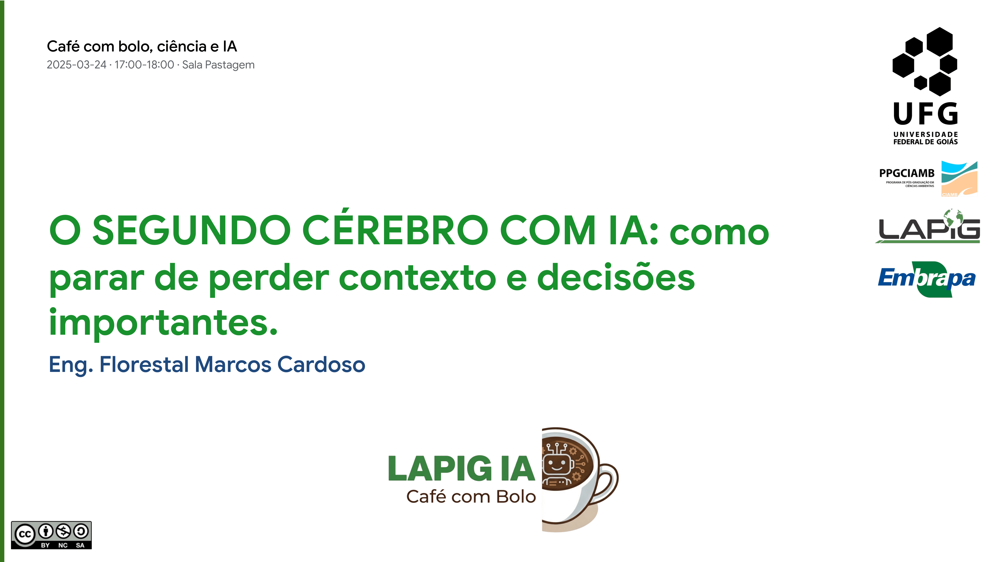
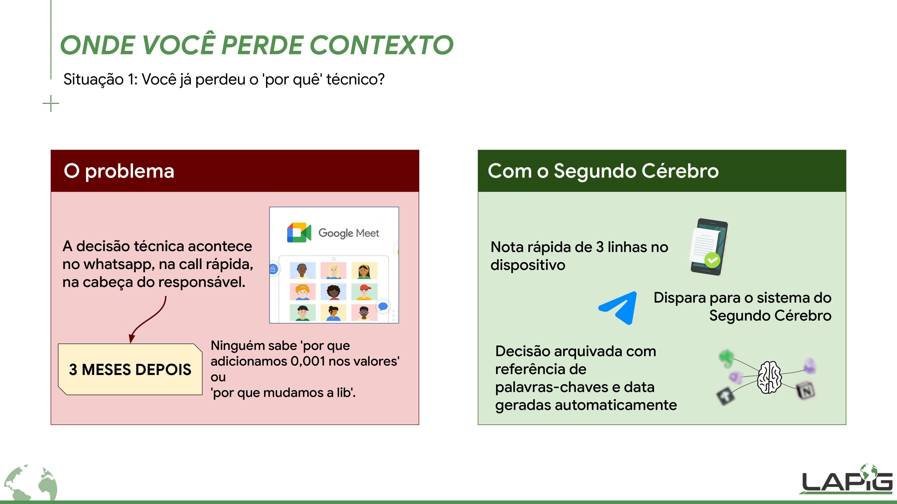
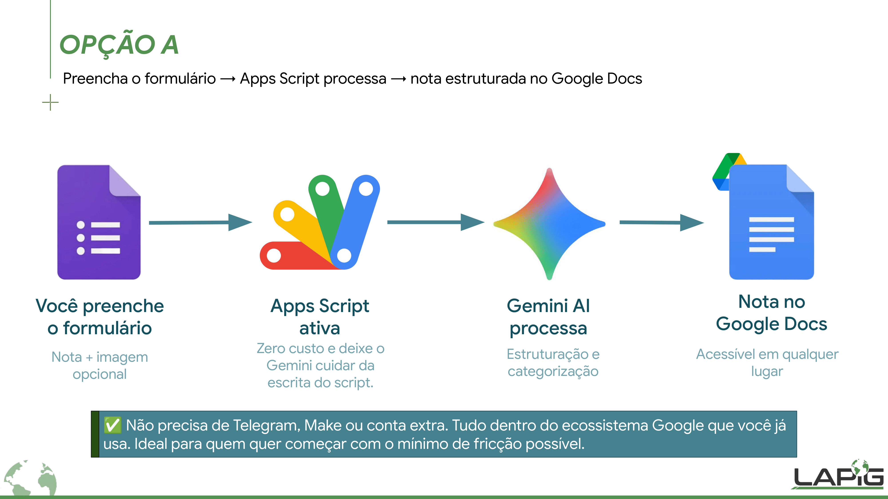
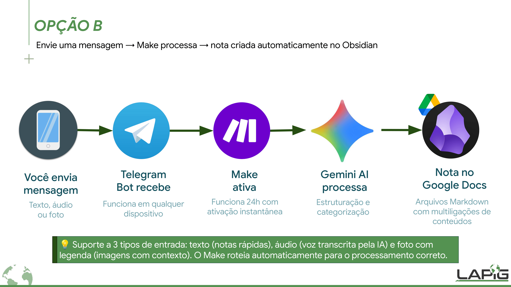
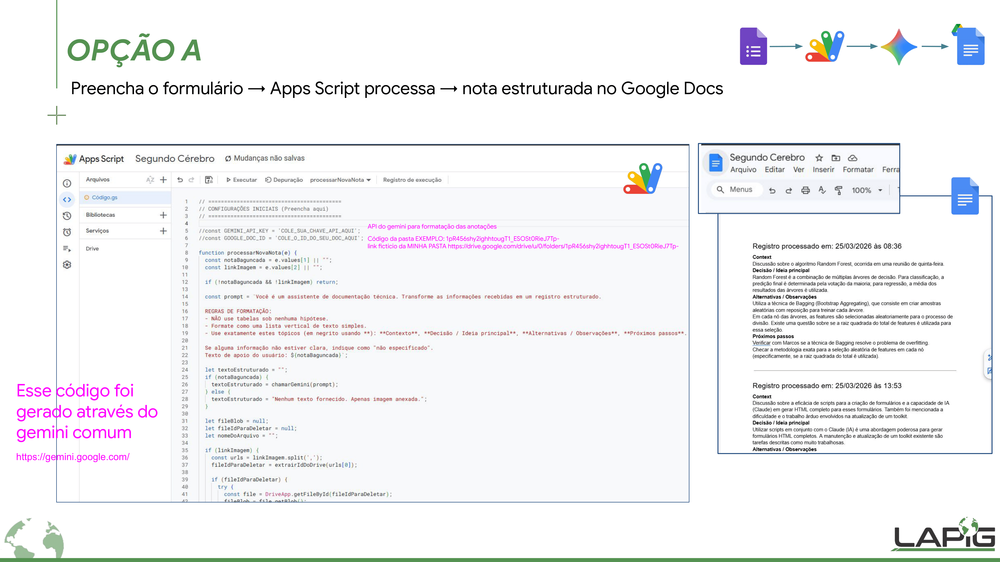
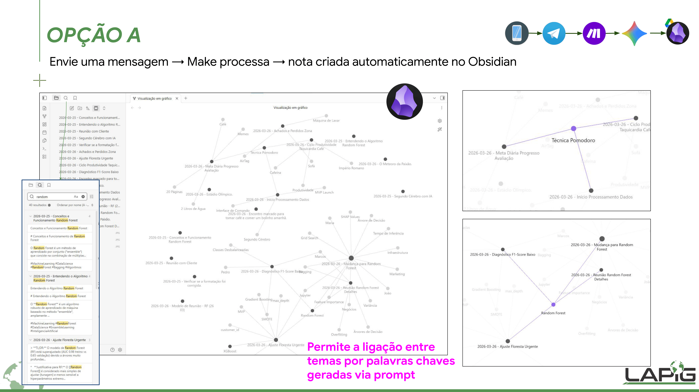
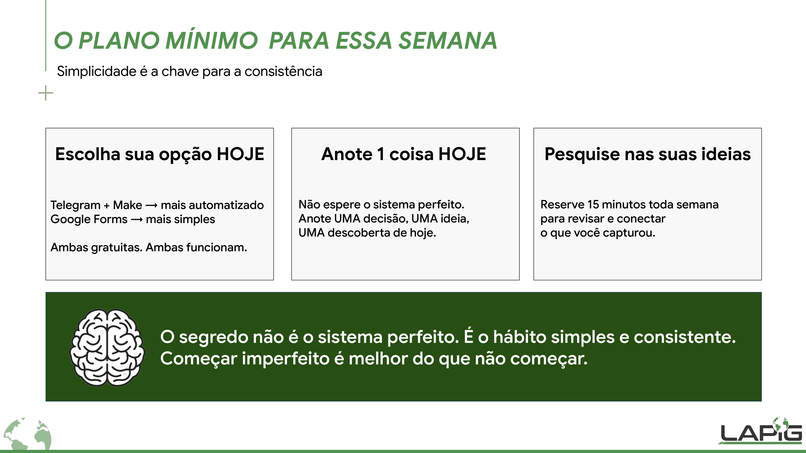

# 🧠 O Segundo Cérebro com IA

Bem-vindo ao repositório do projeto **O SEGUNDO CÉREBRO COM IA: como parar de perder contexto e decisões importantes**. 

Este material foi originado da apresentação no "Café com bolo, ciência e IA" (UFG / LAPIG).

  

---

## ⚠️ O Problema e a Solução

Nossa memória biológica não foi feita para o mundo de hoje. Nosso cérebro foi feito para ter ideias, não para armazená-las. A decisão técnica acontece no WhatsApp ou em uma *call* rápida, e meses depois ninguém sabe o "por quê".

Inspirado no método "Building a Second Brain" de Tiago Forte, este repositório oferece ferramentas para criar um repositório externo de conhecimento. 

  

O objetivo é capturar informações através de métodos simples (áudio, texto, foto) e usar a Inteligência Artificial (Google Gemini) para estruturar, formatar e salvar isso automaticamente no seu sistema.

---

## 🛠️ Escolha o seu Segundo Cérebro

Existem duas formas de montar o seu sistema utilizando os códigos e fluxos deste repositório. Ambas são gratuitas e podem ser configuradas rapidamente.

### [Opção A: A Mais Simples (Ecossistema Google)](Instruções%20Forms%20Docs%20Google%20App%20Scripts.md)
Ideal para quem quer começar com o mínimo de fricção possível. Não precisa de contas extras.

  

* **Fluxo:** Preencha o Google Formulário → Apps Script processa com Gemini → Nota estruturada salva no Google Docs.
* 👉 **[Clique aqui para ver o tutorial e o código da Opção A](Instruções%20Forms%20Docs%20Google%20App%20Scripts.md)**

---

### [Opção B: A Mais Automatizada (Telegram + Make + Obsidian)](Instruções%20Telegram%20Bot%20Obsidian.md)
Ideal para quem já usa o Obsidian e quer capturar ideias via áudio ou texto direto pelo celular.

  

* **Fluxo:** Envie uma mensagem no Telegram → Make.com processa com Gemini → Nota em Markdown criada automaticamente no seu cofre do Obsidian.
* 👉 **[Clique aqui para baixar o blueprint e ver o tutorial da Opção B](Instruções%20Telegram%20Bot%20Obsidian.md)**

---

## 🌌 O Resultado Final

### Na Opção A (Google Docs)
O código formata o texto da sua anotação inicial extraindo o Contexto, as Decisões e os Próximos Passos diretamente no seu documento:

  

### Na Opção B (Grafo no Obsidian)
Com o tempo, se você optar pelo ecossistema do Obsidian, suas notas soltas se transformam em uma rede de conhecimento conectada (Grafo), onde ideias do passado ajudam a resolver problemas do futuro:

  

---

## 📊 Slides da Apresentação

Para entender a fundo a teoria por trás do sistema, o Método CODE (Capturar, Organizar, Destilar, Expressar) e o Sistema PARA (Projetos, Áreas, Recursos, Arquivados), consulte os slides oficiais da apresentação:

* 📄 **[Baixar/Visualizar os Slides Completos em PDF](./03_26_Cafe%20com%20Bolo.pdf)**

---

## 🎯 O Plano Mínimo para Hoje

O segredo não é o sistema perfeito. É o hábito simples e consistente. 

  

1. Escolha sua opção (A ou B).
2. Não espere o sistema perfeito. Anote UMA decisão, UMA ideia ou UMA descoberta hoje.
3. Reserve 15 minutos toda semana para revisar o que você capturou.
